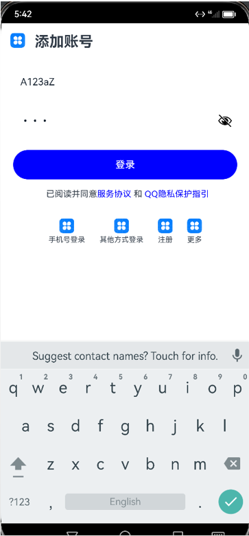

## 这是一个“针对图片生成还原其效果的鸿蒙代码”的工程

#### *思想实现：*

通过LangChain框架建立问答链，共计三层逐级强化生成目标

- **第一层：**

  通过OCR程序识别图片内文本信息 Message1

  调用GPT-4o模型，将目标APP图片、Message1作为输入，得到目标APP图片中所含模块 作为 response1

- **第二层：**

  使用retriever检索HarmonyOS代码库生成的DataBase中获取最相近的工程代码 Ref 作为参考

  调用GPT-4o模型，将目标APP图片、Ref作为输入，得到实现目标APP图片中所需Harmony代码 作为 response2

- **第三层：**

  直接调用GPT-4o模型，将目标APP图片、response2作为输入，强化生成

#### *目录说明：*

**Harmonyos：**

- 实现数据获取，通过爬虫获取华为官方参考文档和gitee中代码

**gptniux：**

- 学习在代码中通过gptniux转接使用GPT模型

**LangChain：**

- 主要工程目录
- EnhancedEdition.py文件即最终实现代码

#### ***注意：***

1. 本工程不含有示例图片，需根据路径自行设置图片测试

2. 本工程调用了OPENAI及LangChain接口，需要配置环境

   ```shell
   #导入openai库
   !pip install openai
   #导入langchain库
   !pip install langchain
   ```

#### ***运行效果（样例）：***

​	输入图片：


​	输出代码在DevStudio中运行效果：




